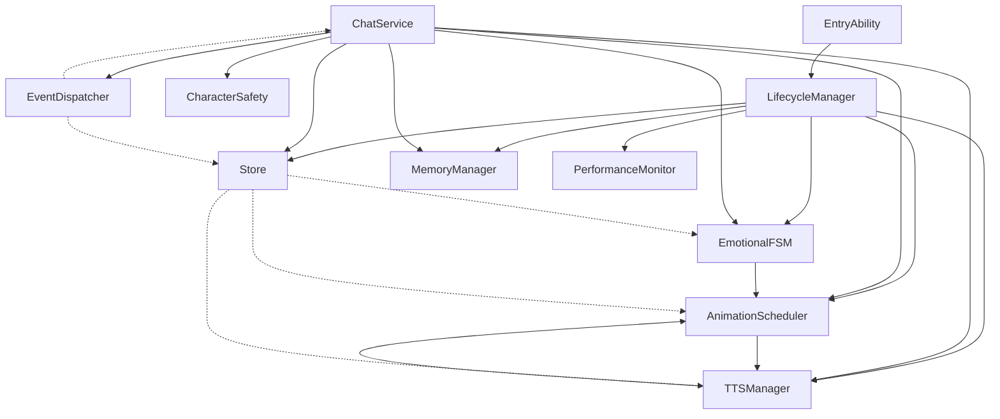

# 星空爱莉 AI 助手 - 架构依赖关系分析报告

**分析日期**: 2026-05-12  
**分析类型**: 静态架构分析  
**分析范围**: 全项目模块依赖关系

---

## 1. 模块列表

### 1.1 核心模块（core/）

| 模块名 | 文件路径 | 职责 | 状态 |
|--------|---------|------|------|
| **LifecycleManager** | `core/LifecycleManager.ets` | 应用生命周期管理、资源协调 | ✅ 已实现 |
| **EmotionalFSM** | `core/EmotionalFSM.ets` | 情绪有限状态机 | ✅ 已实现 |
| **AnimationScheduler** | `core/AnimationScheduler.ets` | 动画队列调度 | ✅ 已实现 |
| **TTSManager** | `core/TTSManager.ets` | TTS 语音管理 | ✅ 已实现 |
| **Store** | `core/Store.ets` | 全局状态管理 | ✅ 已实现 |
| **MemoryManager** | `core/MemoryManager.ets` | 长期记忆管理 | ✅ 已实现 |
| **CharacterSafety** | `core/CharacterSafety.ets` | 角色安全防护 | ✅ 已实现 |
| **ChatService** | `core/ChatService.ets` | 聊天服务整合层 | ✅ 已实现 |
| **EventDispatcher** | `core/EventDispatcher.ets` | 事件分发中心 | ✅ 已实现 |
| **PerformanceMonitor** | `core/PerformanceMonitor.ets` | 性能监控 | ✅ 已实现 |

### 1.2 视图模型层（viewmodel/）

| 模块名 | 文件路径 | 职责 | 状态 |
|--------|---------|------|------|
| **ChatViewModel** | `viewmodel/ChatViewModel.ets` | 聊天视图模型 | ⚠️ 待重构 |

### 1.3 页面层（pages/）

| 模块名 | 文件路径 | 职责 | 状态 |
|--------|---------|------|------|
| **Index** | `pages/Index.ets` | 主页面 UI | ⚠️ 待重构 |

### 1.4 能力层（ability/）

| 模块名 | 文件路径 | 职责 | 状态 |
|--------|---------|------|------|
| **EntryAbility** | `ability/EntryAbility.ets` | 应用入口 | ⚠️ 待完善 |

### 1.5 旧工具模块（utils/）- 待替换

| 模块名 | 文件路径 | 状态 |
|--------|---------|------|
| EmotionUnderstanding | `utils/EmotionUnderstanding.ets` | ⚠️ 待替换为 EmotionalFSM |
| ExpressionManager | `utils/ExpressionManager.ets` | ⚠️ 待替换为 AnimationScheduler |
| BodyActionManager | `utils/BodyActionManager.ets` | ⚠️ 待替换为 AnimationScheduler |
| TextToSpeechManager | `utils/TextToSpeechManager.ets` | ⚠️ 待替换为 TTSManager |
| MemoryManager | `utils/MemoryManager.ets` | ⚠️ 待替换为 core/MemoryManager |
| ThinkingEngine | `utils/ThinkingEngine.ets` | ⚠️ 待整合 |

---

## 2. 依赖关系详细说明

### 2.1 核心依赖链

```
EntryAbility
    ↓
LifecycleManager
    ↓
    ├─→ Store
    ├─→ EmotionalFSM
    ├─→ AnimationScheduler
    ├─→ TTSManager
    ├─→ MemoryManager
    └─→ PerformanceMonitor

ChatService
    ↓
    ├─→ Store
    ├─→ EmotionalFSM
    ├─→ AnimationScheduler
    ├─→ TTSManager
    ├─→ CharacterSafety
    ├─→ MemoryManager
    └─→ EventDispatcher

ChatViewModel
    ↓
    ├─→ MessageModel
    ├─→ PreferencesUtil
    ├─→ NotificationManager
    ├─→ MemoryManager (utils)
    ├─→ EmotionUnderstanding (utils)
    └─→ ThinkingEngine (utils)

Index (页面)
    ↓
    ├─→ ChatViewModel
    ├─→ ExpressionManager (utils)
    ├─→ BodyActionManager (utils)
    ├─→ ThemeManager
    └─→ CharacterAnimation (组件)
```

### 2.2 模块间依赖矩阵

| 从 \ 到 | LifecycleManager | EmotionalFSM | AnimationScheduler | TTSManager | Store | MemoryManager | CharacterSafety | ChatService | ChatViewModel | Index |
|---------|-----------------|--------------|-------------------|------------|-------|---------------|-----------------|-------------|---------------|-------|
| **EntryAbility** | ✅ | ❌ | ❌ | ❌ | ❌ | ❌ | ❌ | ❌ | ❌ | ❌ |
| **LifecycleManager** | - | ✅ | ✅ | ✅ | ✅ | ✅ | ❌ | ❌ | ❌ | ❌ |
| **ChatService** | ❌ | ✅ | ✅ | ✅ | ✅ | ✅ | ✅ | - | ❌ | ❌ |
| **EmotionalFSM** | ❌ | - | ✅ | ❌ | ❌ | ❌ | ❌ | ❌ | ❌ | ❌ |
| **AnimationScheduler** | ❌ | ✅ | - | ❌ | ❌ | ❌ | ❌ | ❌ | ❌ | ❌ |
| **TTSManager** | ❌ | ❌ | ✅ | - | ❌ | ❌ | ❌ | ❌ | ❌ | ❌ |
| **Store** | ❌ | ❌ | ❌ | ❌ | - | ❌ | ❌ | ❌ | ❌ | ❌ |
| **MemoryManager** | ❌ | ❌ | ❌ | ❌ | ❌ | - | ❌ | ❌ | ❌ | ❌ |
| **CharacterSafety** | ❌ | ❌ | ❌ | ❌ | ❌ | ❌ | - | ✅ | ❌ | ❌ |
| **ChatViewModel** | ❌ | ❌ | ❌ | ❌ | ❌ | ✅ | ❌ | ❌ | - | ✅ |
| **Index** | ❌ | ❌ | ❌ | ❌ | ❌ | ❌ | ❌ | ❌ | ✅ | - |

**图例**: ✅ 依赖 | ❌ 不依赖 | - 自身

---

## 3. 架构依赖示意图

### 3.1 整体架构图（新旧并存）

```
┌─────────────────────────────────────────────────────────────────┐
│                        应用入口层                                │
│  ┌─────────────────┐                                           │
│  │ EntryAbility    │ ──→ 应用生命周期                          │
│  └────────┬────────                                           │
│           │                                                     │
│           ▼                                                     │
│  ┌─────────────────┐                                           │
│  │ LifecycleManager│ ──→ 核心模块生命周期管理                   │
│  └────────┬────────┘                                           │
│           │                                                     │
└───────────┼─────────────────────────────────────────────────────┘
            │
┌───────────▼─────────────────────────────────────────────────────┐
│                      核心模块层 (core/)                          │
│  ┌──────────────┐  ┌──────────────┐  ┌──────────────┐         │
│  │ EmotionalFSM │←→│AnimationSched│←→│  TTSManager  │         │
│  │ (情绪状态机)  │  │ (动画调度器)  │  │ (语音管理)   │         │
│  └──────────────┘  └──────────────┘  └──────────────┘         │
│         ▲                 ▲                 ▲                   │
│         │                 │                 │                   │
│  ┌──────┴─────────────────┴─────────────────┴──────┐           │
│  │              ChatService (整合层)                │           │
│  └──────┬─────────────────┬─────────────────┬──────┘           │
│         │                 │                 │                   │
│  ┌──────▼──────┐  ┌──────▼──────┐  ┌──────▼──────┐           │
│  │     Store   │  │MemoryManager│  │CharacterSft │           │
│  │ (状态管理)  │  │ (记忆管理)  │  │ (安全防护)  │           │
│  └─────────────┘  └─────────────┘  └─────────────┘           │
│                                                               │
│  ┌───────────────────────────────────────────────────────┐   │
│  │           EventDispatcher (事件分发中心)               │   │
│  └───────────────────────────────────────────────────────┘   │
│                                                               │
│  ┌───────────────────────────────────────────────────────┐   │
│  │          PerformanceMonitor (性能监控)                 │   │
│  └───────────────────────────────────────────────────────┘   │
└───────────────────────────────────────────────────────────────┘
            │
┌───────────▼─────────────────────────────────────────────────────┐
│                    视图模型层 (viewmodel/)                       │
│  ┌───────────────────────────────────────────────────────┐     │
│  │              ChatViewModel (待重构)                     │     │
│  │  ──→ 依赖 utils/ 旧模块（EmotionUnderstanding 等）      │     │
│  └───────────────────────────────────────────────────────┘     │
└───────────────────────────────────────────────────────────────┘
            │
┌───────────▼─────────────────────────────────────────────────────┐
│                      页面层 (pages/)                             │
│  ┌───────────────────────────────────────────────────────┐     │
│  │                  Index (主页面)                         │     │
│  │  ──→ 直接调用 utils/Manager（高耦合风险点）             │     │
│  └───────────────────────────────────────────────────────┘     │
└───────────────────────────────────────────────────────────────┘
            │
┌───────────▼─────────────────────────────────────────────────────┐
│                      组件层 (components/)                        │
│  ┌──────────────┐ ┌──────────────┐ ┌──────────────┐           │
│  │MessageBubble │ │TypingIndicator│ │CharacterAnim │           │
│  └──────────────┘ └──────────────┘ └──────────────┘           │
└───────────────────────────────────────────────────────────────┘

┌───────────────────────────────────────────────────────────────┐
│                    旧工具模块 (utils/) - 待替换                │
│  ┌──────────────┐ ┌──────────────┐ ┌──────────────┐         │
│  │EmotionUnderst│ │ExpressionMgr │ │BodyActionMgr │         │
│  └──────────────┘ └──────────────┘ └──────────────┘         │
│  ┌──────────────┐ ┌──────────────┐ ┌──────────────┐         │
│  │TextToSpeech  │ │ThinkingEngine│ │MemoryManager │         │
│  └──────────────┘ └──────────────┘ └──────────────┘         │
└───────────────────────────────────────────────────────────────┘
```

### 3.2 新架构核心依赖图（core/）



---

## 4. 高耦合/高风险区域标注

### 🔴 高风险区域 1: ChatService（整合层）

**位置**: `core/ChatService.ets`

**依赖模块**: 7 个
- Store
- EmotionalFSM
- AnimationScheduler
- TTSManager
- CharacterSafety
- MemoryManager
- EventDispatcher

**风险说明**:
- 直接依赖 6 个核心模块
- 任何模块变更都可能影响 ChatService
- 可能成为性能瓶颈
- 单元测试困难

**建议**:
- 保持当前设计，通过接口解耦
- 添加缓存机制减少频繁调用
- 使用 EventDispatcher 异步通信

---

### 🔴 高风险区域 2: LifecycleManager（生命周期中枢）

**位置**: `core/LifecycleManager.ets`

**依赖模块**: 6 个
- EmotionalFSM
- AnimationScheduler
- TTSManager
- MemoryManager
- Store
- PerformanceMonitor

**风险说明**:
- 负责所有核心模块的初始化和销毁
- 初始化顺序错误会导致崩溃
- 资源释放不完整会导致内存泄漏

**建议**:
- 严格按照依赖顺序初始化
- 添加错误恢复机制
- 记录详细日志

---

### 🟡 中风险区域 3: Index 页面（直接调用 Manager）

**位置**: `pages/Index.ets`

**依赖模块**:
- ChatViewModel
- ExpressionManager (utils) ⚠️
- BodyActionManager (utils) ⚠️

**风险说明**:
- **页面直接调用底层 Manager**
- 违反 MVVM 架构
- 难以测试和维护
- 新旧模块混用

**建议**:
- 通过 ViewModel 间接调用
- 迁移到使用 ChatService
- 统一通过 Store 管理状态

---

### 🟡 中风险区域 4: ChatViewModel（职责过重）

**位置**: `viewmodel/ChatViewModel.ets`

**依赖模块**:
- MemoryManager (utils) ⚠️
- EmotionUnderstanding (utils) ⚠️
- ThinkingEngine (utils) ⚠️

**风险说明**:
- ViewModel 承担业务逻辑
- 依赖旧的 utils 模块
- 与 core/ 模块未整合

**建议**:
- 将业务逻辑迁移到 ChatService
- ViewModel 只负责状态暴露
- 整合 core/ 模块

---

### 🟡 中风险区域 5: EmotionalFSM ↔ AnimationScheduler

**关系**: 双向依赖

**风险说明**:
- EmotionalFSM 触发情绪变化时需要调用 AnimationScheduler
- AnimationScheduler 需要根据情绪状态调整动画
- 循环依赖风险

**建议**:
- 通过 EventDispatcher 解耦
- 使用观察者模式
- 单向依赖：AnimationScheduler → EmotionalFSM

---

### 🟡 中风险区域 6: TTSManager ↔ AnimationScheduler

**关系**: 双向依赖（唇型同步）

**风险说明**:
- TTS 播放时需要 AnimationScheduler 控制唇型
- 动画调度需要知道 TTS 状态
- 可能导致死锁

**建议**:
- 明确主从关系：TTSManager 主导
- 通过事件通知，不直接调用
- 添加超时机制

---

## 5. 新旧模块对比

### 5.1 模块替换映射

| 旧模块 (utils/) | 新模块 (core/) | 替换优先级 | 说明 |
|----------------|---------------|----------|------|
| EmotionUnderstanding | EmotionalFSM | P0 | 状态机 vs 简单分析 |
| ExpressionManager | AnimationScheduler | P0 | 队列调度 vs 直接播放 |
| BodyActionManager | AnimationScheduler | P0 | 统一管理 vs 分散管理 |
| TextToSpeechManager | TTSManager | P0 | 音频队列 vs 直接播放 |
| MemoryManager | MemoryManager | P1 | 功能增强版 |
| ThinkingEngine | ChatService | P1 | 整合到 Service 层 |

### 5.2 新旧并存风险

```
当前状态：
┌─────────────────────────────────────────────────────────┐
│  新模块 (core/)           旧模块 (utils/)               │
│  ✅ EmotionalFSM    ←→   ⚠️ EmotionUnderstanding       │
│  ✅ AnimationScheduler ←→ ⚠️ ExpressionManager          │
│  ✅ AnimationScheduler ←→ ⚠️ BodyActionManager          │
│  ✅ TTSManager      ←→   ⚠️ TextToSpeechManager         │
│  ✅ MemoryManager   ←→   ⚠️ MemoryManager (utils)       │
└─────────────────────────────────────────────────────────┘

风险:
1. 状态不同步
2. 资源重复占用
3. 调用链混乱
4. 难以排查问题
```

---

## 6. 调用链分析

### 6.1 用户发送消息的完整调用链

```
用户输入
   ↓
Index.sendMessage()
   ↓
├─→ ExpressionManager.playExpression('excited')  [旧模块]
├─→ ChatViewModel.sendMessage()
│      ↓
│   ├─→ ThinkingEngine.think()  [旧模块]
│   │      ↓
│   │   ├─→ EmotionUnderstanding.analyzeEmotion()  [旧]
│   │   └─→ MemoryManager.searchMemories()  [旧]
│   │
│   ├─→ ThinkingEngine.generateResponse()
│   │
│   └─→ NotificationManager.showNotification()
│
└─→ (缺失) TTS 播放  [新功能]
```

**问题**:
- 新旧模块混用
- TTS 功能缺失
- 无统一调度

### 6.2 理想调用链（重构后）

```
用户输入
   ↓
Index.sendMessage()
   ↓
ChatService.sendUserMessage()  [新 Service 层]
   ↓
├─→ CharacterSafety.checkUserInput()  [安全检查]
├─→ Store.dispatch('ADD_MESSAGE')  [状态更新]
├─→ MemoryManager.addMemory()  [记忆存储]
├─→ EmotionalFSM.triggerEmotion()  [情绪状态机]
├─→ AnimationScheduler.enqueue()  [动画队列]
├─→ ChatService.generateResponse()  [响应生成]
├─→ Store.dispatch('UPDATE_EMOTION')  [状态同步]
├─→ TTSManager.speak()  [语音播放]
└─→ EventDispatcher.dispatch('MESSAGE_SENT')  [事件通知]
```

---

## 7. 架构改进建议

### 7.1 短期（P0 - 阻塞性问题）

1. **集成 LifecycleManager**
   - 在 EntryAbility 调用
   - 在 Index 注册生命周期
   - 清理定时器泄漏

2. **集成 TTSManager**
   - 在 ChatService 调用 TTS
   - 添加音频队列
   - 实现唇型同步

3. **修复 Index 直接调用**
   - 通过 ViewModel 调用
   - 或使用 ChatService

### 7.2 中期（P1 - 架构解耦）

1. **整合 core/ 模块**
   - 替换所有 utils/ 旧模块
   - 统一使用 Store 管理状态
   - 通过 EventDispatcher 通信

2. **重构 ChatViewModel**
   - 业务逻辑迁移到 ChatService
   - ViewModel 只负责状态暴露
   - 简化依赖关系

3. **添加 DebugPanel**
   - 显示 FSM 状态
   - 显示动画队列
   - 显示性能指标

### 7.3 长期（P2 - 优化迭代）

1. **性能优化**
   - 添加缓存层
   - 异步处理
   - 减少重绘

2. **测试覆盖**
   - 单元测试
   - 集成测试
   - 性能测试

---

## 8. 重构风险提示

### ⚠️ 高风险操作

| 操作 | 风险等级 | 影响范围 | 建议 |
|------|---------|---------|------|
| 替换 EmotionalFSM |  高 | 全应用情绪系统 | 并行运行，逐步切换 |
| 替换 AnimationScheduler | 🚨 高 | 所有动画 | 保持旧模块，使用 feature flag |
| 替换 TTSManager | 🚨 高 | 语音功能 | 先集成再替换 |
| 重构 ChatViewModel | 🟡 中 | 聊天功能 | 分步骤迁移 |
| 重构 Index | 🟡 中 | UI 交互 | 小步快跑，频繁测试 |

### ✅ 安全操作

| 操作 | 风险等级 | 说明 |
|------|---------|------|
| 添加 LifecycleManager | 🟢 低 | 只添加回调，不影响现有逻辑 |
| 添加 CharacterSafety | 🟢 低 | 只添加过滤，不影响对话逻辑 |
| 添加 PerformanceMonitor | 🟢 低 | 只监控，不干预业务 |
| 添加 EventDispatcher | 🟢 低 | 新增通信渠道，不影响现有调用 |

---

## 9. 下一步行动建议

### 立即执行（Step 2）

**并行接入生命周期管理（LifecycleManager）**

修改文件:
- `EntryAbility.ets`
- `Index.ets`

修改内容:
1. 在 EntryAbility 调用 LifecycleManager.init()
2. 在 Index 注册页面生命周期
3. 清理现有定时器

---

**架构分析完成**

下一步：开始 Step 2 - 并行接入生命周期管理（LifecycleManager）
